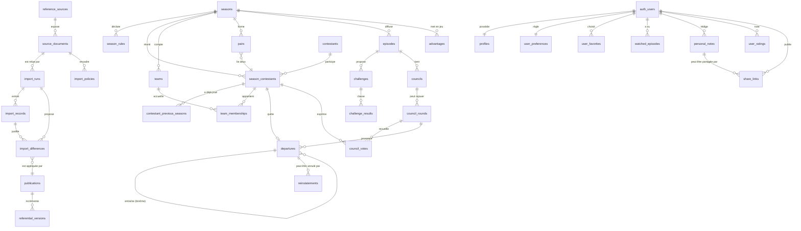

# Modèle de données

_Établi le 05/09/2026, à partir de l'audit du socle et d'une lecture réelle de
la source (révision 239179934 du 03/09/2026)._

Les migrations sont dans [`supabase/migrations`](../supabase/migrations) :

| Fichier                | Contenu                                                   |
| ---------------------- | --------------------------------------------------------- |
| `0001_referentiel.sql` | Référentiel publié + provenance                           |
| `0002_import.sql`      | Pipeline d'import : exécutions, différences, publications |
| `0003_personnel.sql`   | Profils, préférences, favoris, notes, partage             |

## Les quatre catégories, et la frontière entre elles

| Catégorie           | Tables                                                                                                 | Qui écrit                         |
| ------------------- | ------------------------------------------------------------------------------------------------------ | --------------------------------- |
| **Référentiel**     | `seasons` … `advantages`                                                                               | Le serveur seul, après validation |
| **Personnel**       | `profiles`, `user_preferences`, `user_favorites`, `watched_episodes`, `personal_notes`, `user_ratings` | Son propriétaire uniquement       |
| **Partagé**         | `share_links` + les colonnes `visibility`                                                              | Son propriétaire, explicitement   |
| **Synchronisation** | `import_runs`, `import_records`, `import_differences`, `publications`, `referential_versions`          | Le pipeline serveur               |

La frontière n'est pas décorative : **aucune table du référentiel n'a de
politique d'écriture pour un utilisateur authentifié.** Un client ne peut pas
corriger une donnée, même la sienne — il propose, le serveur publie.

## Diagramme

## Les six décisions qui s'écartent de la liste du besoin

Chacune vient d'un fait vérifié, pas d'une préférence.

### 1. `departures` remplace `eliminations`

Le besoin nommait la table `eliminations`. La source la contredit dès le
troisième épisode : **Joana quitte l'aventure avec zéro vote**, parce que son
binôme Maxime a été éliminé. Ce n'est pas une élimination, et l'appeler ainsi
fausserait toute statistique de votes reçus.

`departures.kind` couvre les huit sorties observées ou prévisibles — `vote`,
`linked_pair`, `quit`, `medical`, `banned`, `jury_exit`, `final_ranking`,
`other` — et `caused_by_departure_id` s'auto-référence, ce qui permet à la
chronologie d'écrire « partie à la suite de Maxime » au lieu de laisser un
départ inexpliqué.

### 2. `council_rounds` s'intercale entre le conseil et les votes

La source écrit `<s>9-9</s> / **11**-7` : premier vote à égalité, annulé, puis
second vote entre les deux ex æquo. **Sans niveau intermédiaire, ces deux
décomptes s'écrasent** et l'égalité devient invisible. Un conseil a donc un ou
plusieurs tours, et c'est le tour qui porte le résultat.

### 3. Pas de table `immunities`

Le besoin en demandait une. Elle serait **intégralement dérivable** de
`challenge_results` (épreuve d'immunité gagnée) et d'`advantages` (collier
joué). La stocker en plus, c'est se donner deux vérités qui divergeront au
premier import corrigé — ce que le besoin interdit lui-même au §4. Une vue la
calculera.

### 4. Les règles de saison sont des données

« Si un membre du duo est éliminé, son binôme part aussi » est vrai de
**cette** édition. Codé en dur, il rendrait la deuxième saison impossible à
ajouter sans réécrire le moteur. `season_rules` le porte, daté et paramétrable,
et le moteur lit la règle au lieu de la présumer.

### 5. Sept clés étrangères nullables plutôt qu'une cible polymorphe

Une note vise une saison, un candidat, un épisode, une équipe, une épreuve, un
conseil ou un départ. Le couple `(target_type, target_id)` aurait été plus
court **et incapable de porter la moindre intégrité** : rien n'y empêche un
identifiant d'épisode rangé sous « candidat », ni une cible supprimée de
laisser une note orpheline. Sept colonnes nullables, un `CHECK` de cardinalité,
et `ON DELETE CASCADE` fait son travail.

Le même choix vaut pour `challenge_results`, dont le sujet est exactement un
candidat, une équipe **ou** un binôme.

### 6. Pseudonyme et identifiant public sont deux colonnes

Le besoin demandait une règle d'unicité « explicitement définie ». La voici :
**le pseudonyme n'est pas unique**, l'identifiant public l'est. Deux personnes
ont le droit de s'appeler « Tarzan » ; imposer l'unicité sur un libellé
transformerait chaque inscription en course au nom. `public_handle` est
contraint par expression régulière, confronté à `reserved_handles`, et reste
`null` tant que le profil est privé.

## Zéro n'est pas inconnu

La saison est **en cours** : la moitié du tableau source est vide. Trois
mécanismes distinguent l'absence de la valeur nulle :

- `reported_votes_for` / `reported_votes_total` sont **nullables**, et `0` y est
  une valeur légitime — l'élimination de binôme se lit littéralement « 0 vote » ;
- `council_rounds.votes_complete` dit si le détail individuel est intégral ;
  toute statistique qui agrège des votes doit le lire avant de conclure ;
- `council_votes` distingue **trois** situations : a voté pour X
  (`target_id` renseigné), n'a pas voté (`did_not_vote`), et a voté pour un
  inconnu (`target_id is null` sans `did_not_vote`).

## Provenance : chaque ligne sait d'où elle vient

Toute table du référentiel porte `source_document_id`, `validation_status` et
`published_at`. L'interface peut donc afficher, **pour chaque valeur** : la
source, son lien, la révision lue, la date de récupération et le statut de
validation — et l'avertissement que Wikipédia est collaboratif.

Le contenu source est en **CC BY-SA 4.0** (vérifié via `meta=siteinfo`) :
l'attribution est obligatoire et le partage à l'identique s'impose aux données
dérivées. Voir [attribution.md](./attribution.md).

## Ce qui n'est pas encore écrit

- **Les politiques RLS** (`0004_rls.sql`) : les tables sont créées avec
  `ENABLE` **et** `FORCE ROW LEVEL SECURITY` et **aucune politique**. En l'état,
  elles ne répondent à personne — un schéma poussé à moitié n'expose rien.
- Les vues calculées (immunités, classements, chronologie).
- Le jeu de données de démonstration, qui sera marqué
  « Donnée fictive de démonstration ».
